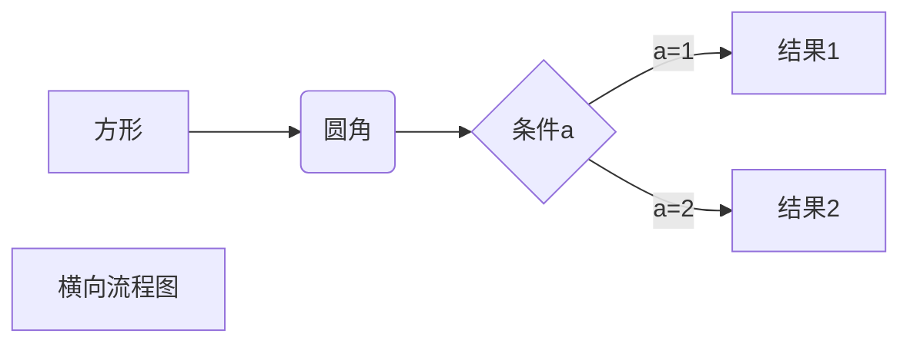
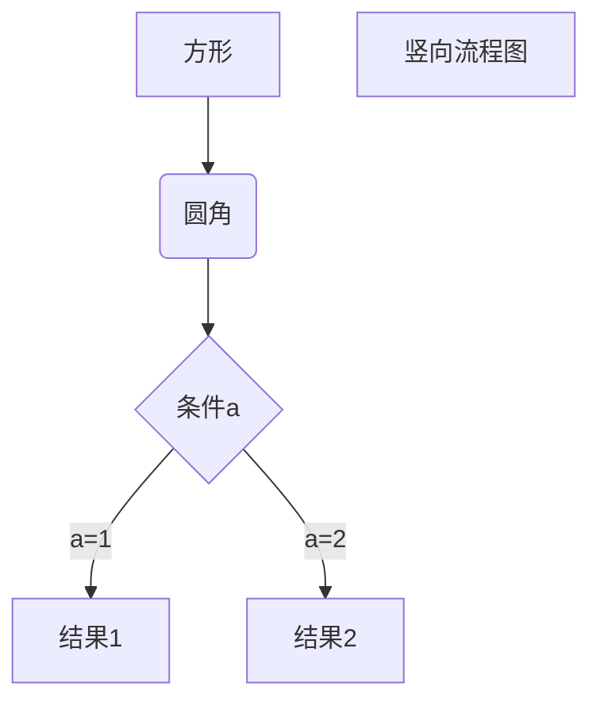
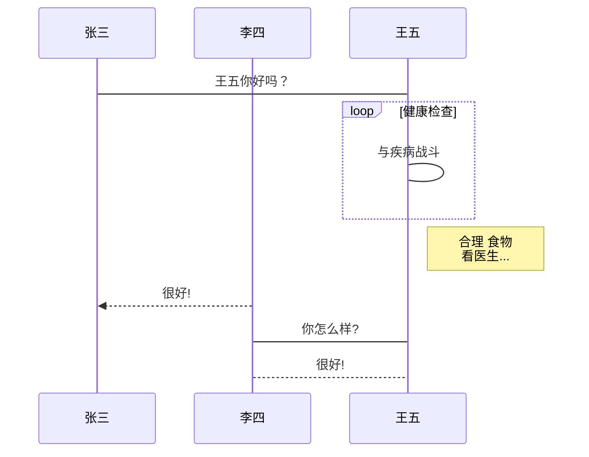
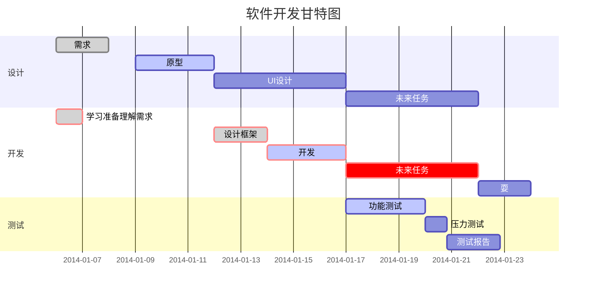

# Markdown教程


## 1 段落格式

### 1.1 标题

```
# 一级标题
## 二级标题
### 三级标题
#### 四级标题
##### 五级标题
###### 六级标题
```


### 1.2 段落

Markdown 段落没有特殊的格式，直接编写文字就好，段落的换行是使用两个以上空格加上回车

HUWENFENG.XYZ     
GOOGLE.COM

或者

HUWENFENG.XYZ(也可在段落后面使用一个空行表示重新开始一个段落)     


GOOGLE.COM


### 1.3 字体

格式：

```
*斜体文本*
**粗体文本**
***斜体加粗文本***

_斜体文本_
__粗体文本__
___斜体加粗文本___
```

示例：

*斜体文本*
**粗体文本**
***斜体加粗文本***

_斜体文本_
__粗体文本__
___斜体加粗文本___


### 1.4 分割线

概述：

可以在一行中用三个或者以上的星号、减号、底线来建立一个分割线。也可以在符号中间插入空格。

```
***
---
___
```

示例：

***

---

___


### 1.5 删除线

概述：

删除线使用前后各两个波浪线`~~`即可。

```
BAIDU.COM
~~BAIDU.COM~~
```

示例：

BAIDU.COM
~~BAIDU.COM~~


### 1.6 下划线

概述：通过 html中的`u`标签实现。

```html
<u>带下划线文本</u>
```

示例：

<u>带下划线文本</u>  


### 1.7 脚注

概述：脚注是对文本的补充说明，通过`^`符号实现。

```
[^要注明的文本]
```

创建脚注格式类似这样 [^Markdown]。

[^Markdown]: Markdown -- 超级好用的标记语言


## 2 列表

### 2.1 无序列表

概述：无序列表使用`(-)减号` `(+)加号`  `(*)`

```
- 第一项
- 第二项

+ 第一项
+ 第二项

* 第一项
* 第二项
```

示例：
- 第一项
- 第二项

+ 第一项
+ 第二项

* 第一项
* 第二项


### 2.2 有序列表 

概述：有序列表使用` 数字 + . + 空格` 

```
1. 第一项 
2. 第二项
3. 第三项
```

示例：

1. 第一项 
2. 第二项
3. 第三项


### 2.3 列表嵌套

概述：列表嵌套只需在子列表中的选项添加四个空格。

```
- 第一项：
    - 第一项嵌套的第一个元素
    - 第一项嵌套的第二个元素
- 第二项：
    - 第二项嵌套的第一个元素
    - 第二项嵌套的第二个元素

1. 第一项：
    - 第一项嵌套的第一个元素
    - 第一项嵌套的第二个元素
2. 第二项：
    - 第二项嵌套的第一个元素
    - 第二项嵌套的第二个元素
```

示例：

- 第一项：
  - 第一项嵌套的第一个元素
  - 第一项嵌套的第二个元素

- 第二项：
  - 第二项嵌套的第一个元素
  - 第二项嵌套的第二个元素

1. 第一项：
    - 第一项嵌套的第一个元素
    - 第一项嵌套的第二个元素
2. 第二项：
    - 第二项嵌套的第一个元素
    - 第二项嵌套的第二个元素


## 3 区块

### 3.1 区块引用

 概述：段落开头使用`>`符号，后面紧跟一个**空格**符号。

```
> 区块应用
> Markdown
```

示例：

> 区块应用
> Markdown


### 3.2 区块嵌套

```
> 最外层
> > 第一层嵌套
> > > 第二次嵌套
```

示例：

> 最外层
> > 第一层嵌套
> >
> > > 第二次嵌套


### 3.3 区块使用列表

```
> 区块中也可使用列表
> 1. 第一项
> 2. 第二项 
> - 第一项
> - 第二项
> - 第三项
```

示例：

> 区块中也可使用列表
> 1. 第一项
> 2. 第二项 
> - 第一项
>
> - 第二项
>
> - 第三项


### 3.4 列表使用区块：

```
- 第一项
	> 引用一
	> 应用二
- 第二项	
```

- 第一项
	> 引用一
	> 应用二
- 第二项	


## 4 代码

### 4.1 小片段

概述：使用两个反引号（**`**）包起来

```
`printf()` 函数
```

示例：`printf()` 函数


### 4.2  代码区块

概述：可以使用两个  ``` 包裹一段代码，并也可指定一种语言(关键字会高亮显示) 

```java
​```
public class Hello {
  public static void main (String [] args) {
    System.out.print("Hello World");
  }
}
​```
```

示例：

```java
public class Hello {
  public static void main (String [] args) {
    System.out.print("Hello World");
  }
}
```


### 4.3 链接

#### 基本链接

概述：连接使用方法如下

```
1. [链接名称](链接地址)
比如：这是一个链接 [v-blog](http://huwenfeng.xyz/v-blog/)
或者
2. <链接地址>
比如：<http://huwenfeng.xyz/v-blog/>
或者
3. 链接地址
比如：http://huwenfeng.xyz/v-blog/
```

示例:

这是一个链接 [v-blog](http://huwenfeng.xyz/v-blog/)

<http://huwenfeng.xyz/v-blog/>

http://huwenfeng.xyz/v-blog/


#### 高级链接

概述：通过变量来设置一个链接。变量赋值在文档末尾进行。

```
此链接用1作为网址变量 [Baidu][1]
此链接用huwenfeng作为网址变量 [HuWenFeng][huwenfeng]

[1]: http://www.baidu.com/
[huwenfeng]: http://huwenfeng.xyz/v-blog/
```

示例：

此链接用1作为网址变量 [Baidu][1]
此链接用huwenfeng作为网址变量 [HuWenFeng][huwenfeng]

[1]: http://www.baidu.com/
[huwenfeng]: http://huwenfeng.xyz/v-blog/


## 5 图片

### 5.1 基本图片显示

概述：图片语法格式如下：

```


开头一个感叹号！ 
接着一个方括号，里面放上图片的替代文字
接着一个普通括号，里面放上图标的网址，[最后还有可选的引号包裹的的标题]
```

示例：

```

```


```

```


### 5.2 链接显示图片

```
这个链接用 1 作为网址变量 [RUNOOB][1].
然后在文档的结尾为变量赋值（网址）

[1]: http://static.runoob.com/images/runoob-logo.png
```

示例：

这个链接用 2 作为网址变量 [RUNOOB][2].
然后在文档的结尾为变量赋值（网址）

[2]: http://static.runoob.com/images/runoob-logo.png


### 5.3 修改图片大小

Markdown 还没有办法指定图片的高度与宽度，如果你需要的话，你可以使用普通的  标签。

```

```


## 6 表格

概述：

Markdown 制作表格使用 **|** 来分隔不同的单元格，使用 **-** 来分隔表头和其他行。

语法格式如下：

```
|  表头   | 表头  |
|  ----  | ----  |
| 单元格  | 单元格 |
| 单元格  | 单元格 |
```

示例：

| 表头   | 表头   |
| ------ | ------ |
| 单元格 | 单元格 |
| 单元格 | 单元格 |

对齐方式：

```
-: 设置内容和标题栏居右对齐。
:- 设置内容和标题栏居左对齐。
:-: 设置内容和标题栏居中对齐。
```

```
| 左对齐 | 居中对齐 | 后对齐 |
| :-----| :----: | ----: |
| 单元格 | 单元格 | 单元格 |
| 单元格 | 单元格 | 单元格 |
```

示例：

| 左对齐 | 居中对齐 | 后对齐 |
| :----- | :------: | -----: |
| 单元格 |  单元格  | 单元格 |
| 单元格 |  单元格  | 单元格 |


## 7 高级技巧


### 支持的 HTML 元素

不在 Markdown 涵盖范围之内的标签，都可以直接在文档里面用 HTML 撰写。

目前支持的 HTML 元素有：`       `等 ，如：

```
使用 <kbd>Ctrl</kbd>+<kbd>Alt</kbd>+<kbd>Del</kbd> 重启电脑
```

输出结果为：


### 转义

Markdown 使用了很多特殊符号来表示特定的意义，如果需要显示特定的符号则需要使用转义字符，Markdown 使用反斜杠转义特殊字符：

```
**文本加粗** 
\*\* 正常显示星号 \*\*
```

输出结果为：


Markdown 支持以下这些符号前面加上反斜杠来帮助插入普通的符号：

```
\   反斜线
`   反引号
*   星号
_   下划线
{}  花括号
[]  方括号
()  小括号
#   井字号
+   加号
-   减号
.   英文句点
!   感叹号
```

### 公式

当你需要在编辑器中插入数学公式时，可以使用两个美元符 $$ 包裹 TeX 或 LaTeX 格式的数学公式来实现。提交后，问答和文章页会根据需要加载 Mathjax 对数学公式进行渲染。如：

```
$$
\mathbf{V}_1 \times \mathbf{V}_2 =  \begin{vmatrix} 
\mathbf{i} & \mathbf{j} & \mathbf{k} \\
\frac{\partial X}{\partial u} &  \frac{\partial Y}{\partial u} & 0 \\
\frac{\partial X}{\partial v} &  \frac{\partial Y}{\partial v} & 0 \\
\end{vmatrix}
${$tep1}{\style{visibility:hidden}{(x+1)(x+1)}}
$$
```

示例：
$$
\mathbf{V}_1 \times \mathbf{V}_2 =  \begin{vmatrix} 
\mathbf{i} & \mathbf{j} & \mathbf{k} \\
\frac{\partial X}{\partial u} &  \frac{\partial Y}{\partial u} & 0 \\
\frac{\partial X}{\partial v} &  \frac{\partial Y}{\partial v} & 0 \\
\end{vmatrix}
${$tep1}{\style{visibility:hidden}{(x+1)(x+1)}}
$$


## 8 常用的效果图

### 8.1 横向流程图源码格式

```
​```mermaid
graph LR
A[方形] -->B(圆角)
    B --> C{条件a}
    C -->|a=1| D[结果1]
    C -->|a=2| E[结果2]
    F[横向流程图]
​```
```

示例：



### 8.2  竖向流程图源码格式

```
​```mermaid
graph TD
A[方形] --> B(圆角)
    B --> C{条件a}
    C --> |a=1| D[结果1]
    C --> |a=2| E[结果2]
    F[竖向流程图]
​```
```



### 8.3 标准流程图源码格式

```
​```flow
st=>start: 开始框
op=>operation: 处理框
cond=>condition: 判断框(是或否?)
sub1=>subroutine: 子流程
io=>inputoutput: 输入输出框
e=>end: 结束框
st->op->cond
cond(yes)->io->e
cond(no)->sub1(right)->op
​```
```

示例：

```flow
st=>start: 开始框
op=>operation: 处理框
cond=>condition: 判断框(是或否?)
sub1=>subroutine: 子流程
io=>inputoutput: 输入输出框
e=>end: 结束框
st->op->cond
cond(yes)->io->e
cond(no)->sub1(right)->op
```


### 8.4 标准流程图源码格式（横向）

```
​```flow
st=>start: 开始框
op=>operation: 处理框
cond=>condition: 判断框(是或否?)
sub1=>subroutine: 子流程
io=>inputoutput: 输入输出框
e=>end: 结束框
st(right)->op(right)->cond
cond(yes)->io(bottom)->e
cond(no)->sub1(right)->op
​```
```

示例：

```flow
st=>start: 开始框
op=>operation: 处理框
cond=>condition: 判断框(是或否?)
sub1=>subroutine: 子流程
io=>inputoutput: 输入输出框
e=>end: 结束框
st(right)->op(right)->cond
cond(yes)->io(bottom)->e
cond(no)->sub1(right)->op
```


### 8.5 UML时序图源码样例

```
​```sequence
对象A->对象B: 对象B你好吗?（请求）
Note right of 对象B: 对象B的描述
Note left of 对象A: 对象A的描述(提示)
对象B-->对象A: 我很好(响应)
对象A->对象B: 你真的好吗？
​```
```

```sequence
对象A->对象B: 对象B你好吗?（请求）
Note right of 对象B: 对象B的描述
Note left of 对象A: 对象A的描述(提示)
对象B-->对象A: 我很好(响应)
对象A->对象B: 你真的好吗？
```


### 8.6 UML时序图源码复杂样例

```
​```sequence
Title: 标题：复杂使用
对象A->对象B: 对象B你好吗?（请求）
Note right of 对象B: 对象B的描述
Note left of 对象A: 对象A的描述(提示)
对象B-->对象A: 我很好(响应)
对象B->小三: 你好吗
小三-->>对象A: 对象B找我了
对象A->对象B: 你真的好吗？
Note over 小三,对象B: 我们是朋友
participant C
Note right of C: 没人陪我玩
​```
```

示例：

```sequence
Title: 标题：复杂使用
对象A->对象B: 对象B你好吗?（请求）
Note right of 对象B: 对象B的描述
Note left of 对象A: 对象A的描述(提示)
对象B-->对象A: 我很好(响应)
对象B->小三: 你好吗
小三-->>对象A: 对象B找我了
对象A->对象B: 你真的好吗？
Note over 小三,对象B: 我们是朋友
participant C
Note right of C: 没人陪我玩
```

### 8.7 UML标准时序图样例

```
​```mermaid
%% 时序图例子,-> 直线，-->虚线，->>实线箭头
  sequenceDiagram
    participant 张三
    participant 李四
    张三->王五: 王五你好吗？
    loop 健康检查
        王五->王五: 与疾病战斗
    end
    Note right of 王五: 合理 食物 <br/>看医生...
    李四-->>张三: 很好!
    王五->李四: 你怎么样?
    李四-->王五: 很好!
​```
```

示例：




### 8.8 甘特图样例

```
​```mermaid
%% 语法示例
        gantt
        dateFormat  YYYY-MM-DD
        title 软件开发甘特图
        section 设计
        需求                      :done,    des1, 2014-01-06,2014-01-08
        原型                      :active,  des2, 2014-01-09, 3d
        UI设计                     :         des3, after des2, 5d
    未来任务                     :         des4, after des3, 5d
        section 开发
        学习准备理解需求                      :crit, done, 2014-01-06,24h
        设计框架                             :crit, done, after des2, 2d
        开发                                 :crit, active, 3d
        未来任务                              :crit, 5d
        耍                                   :2d
        section 测试
        功能测试                              :active, a1, after des3, 3d
        压力测试                               :after a1  , 20h
        测试报告                               : 48h
​```
```




